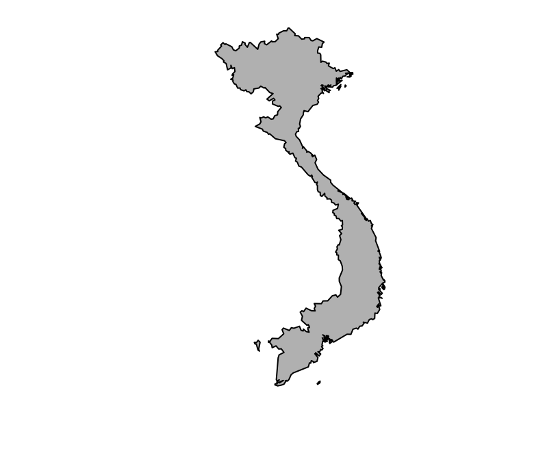

<!-- README.md is generated from README.Rmd. Please edit that file -->
gadmSEA
=======

[](https://travis-ci.org/choisy/gadmSEA) [](https://cran.r-project.org/package=gadmSEA)

The goal of `gadmSEA` is to ease the drawing of location maps of any set of countries from Southeast Asia. **This package contains no function and basically simply provides the polygons of the following 28 countries**: Afghanistan, Bangladesh, Bhutan, Cambodia, China, India, Japan, Indonesia, Japan, Kazakhstan, Korea, Kyrgystan, Lao PDR, Malaysia, Mongolia, Myanmar, Nepal, North Korea, Paskistan, Papua New Guinea, the Philippines, Russia, Singapore, Sri Lanka, Taiwan, Tajikistan, Thailand, Uzbekistan and Vietnam. These polygons come from [GADM](http://www.gadm.org).

Installation
------------

You can install `gadmSEA` from github with:

``` r
> # install.packages("devtools")
> devtools::install_github("choisy/gadmSEA")
```

Usage
-----

The list of available countries can be seen with the `mcutils::dataset` function that returns the list of the names of the data sets available in a given package.

``` r
> mcutils::datasets("gadmSEA")
#>  [1] "afghanistan"    "bangladesh"     "bhutan"         "cambodia"      
#>  [5] "china"          "india"          "indonesia"      "japan"         
#>  [9] "kazakhstan"     "korea"          "kyrgyzstan"     "laos"          
#> [13] "malaysia"       "mongolia"       "myanmar"        "nepal"         
#> [17] "northkorea"     "pakistan"       "papuanewguinea" "philippines"   
#> [21] "russia"         "singapore"      "srilanka"       "taiwan"        
#> [25] "tajikistan"     "thailand"       "uzbekistan"     "vietnam"
```

The package `mcutils` can be installed from GitHub:

``` r
> # install.packages("devtools")
> devtools::install_github("choisy/mcutils")
```

To load a specific country, we can either access directly to the data set:

``` r
> vietnam <- gadmSEA::vietnam
```

or use the `utils::data` function:

``` r
> data(vietnam, package = "gadmSEA")
```

These polygons are of class `SpatialPolygonsDataFrame`:

``` r
> class(vietnam)
#> [1] "SpatialPolygonsDataFrame"
#> attr(,"package")
#> [1] "sp"
```

and can be plotted with the `sp::plot` corresponding method:

``` r
> sp::plot(vietnam, col = "grey")
```


